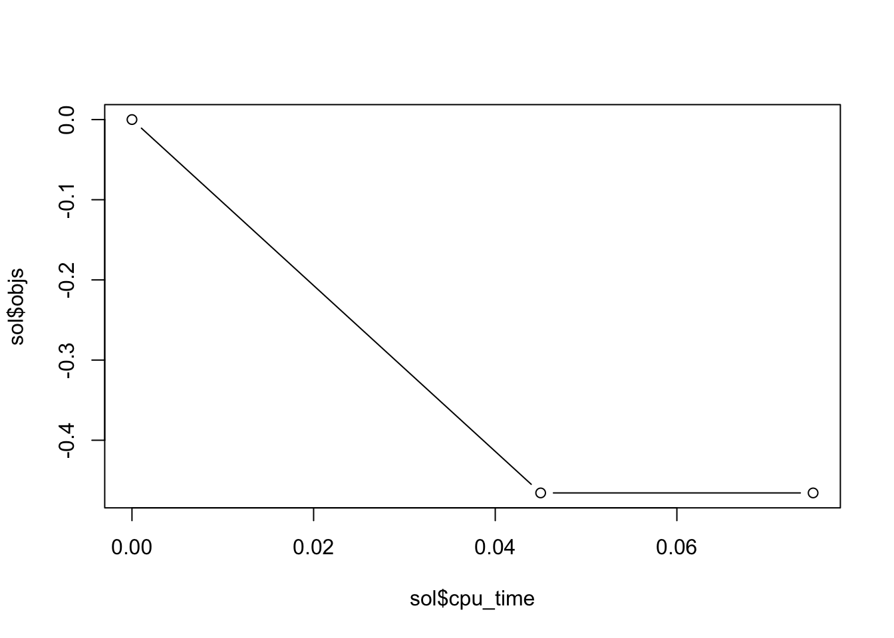
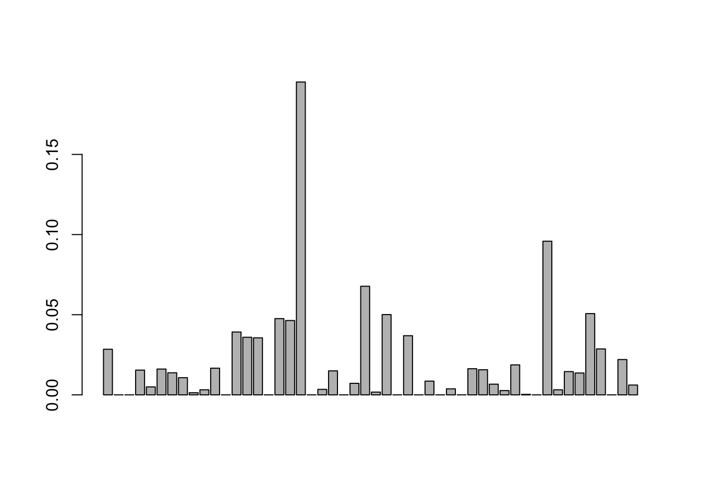

<!-- README.md is generated from README.Rmd. Please edit that file -->


# highOrderPortfolios
<!---
[](https://CRAN.R-project.org/package=highOrderPortfolios)
[](https://CRAN.R-project.org/package=highOrderPortfolios)
[](https://CRAN.R-project.org/package=highOrderPortfolios)
--->

The classical Markowitz's mean-variance portfolio formulation ignores 
heavy tails and skewness. High-order portfolios use higher order moments to
better characterize the return distribution. Different formulations and fast 
algorithms are proposed for high-order portfolios based on the mean, variance, 
skewness, and kurtosis.
The package is based on the paper: Zhou and Palomar (2020).


## Installation
The package can be installed from <!---[CRAN](https://CRAN.R-project.org/package=highOrderPortfolios) or---> [GitHub](https://github.com/dppalomar/highOrderPortfolios):

```r
# install stable version from CRAN
install.packages("highOrderPortfolios")

# install development version from GitHub
devtools::install_github("dppalomar/highOrderPortfolios")
```

To get help:

```r
library(highOrderPortfolios)
help(package = "highOrderPortfolios")
?design_MVSK_portfolio
```

To cite `highOrderPortfolios` in publications:

```r
citation("highOrderPortfolios")
```


## Usage

```r
library(highOrderPortfolios)
data(X50)

# estimate parameters
X_moments <- estimate_moments(X50, adjust_magnitude = TRUE)

# decide problem setting
w0 <- rep(1/50, 50)
w0_moments <- eval_portfolio_moments(w0, X_moments)
d <- abs(w0_moments) 
kappa <- sqrt(w0%*%X_moments$Sgm%*%w0) * 0.3

# portfolio optimization
sol <- design_MVSKtilting_portfolio(d, X_moments, w_init = w0, w0 = w0, w0_moments = w0_moments, kappa = kappa)

# plot
plot(sol$cpu_time, sol$objs, "b")
```



```r
barplot(sol$w)
```




<!---
## Documentation
For more detailed information, please check the
[vignette](https://CRAN.R-project.org/package=highOrderPortfolios/vignettes/highOrderPortfolios.html).
--->


## Links
Package: <!---[CRAN](https://CRAN.R-project.org/package=highOrderPortfolios) and---> [GitHub](https://github.com/dppalomar/highOrderPortfolios).

README file: [GitHub-readme](https://github.com/dppalomar/highOrderPortfolios/blob/master/README.md).

<!---Vignette: [CRAN-vignette](https://CRAN.R-project.org/package=highOrderPortfolios/vignettes/highOrderPortfolios.html).--->

